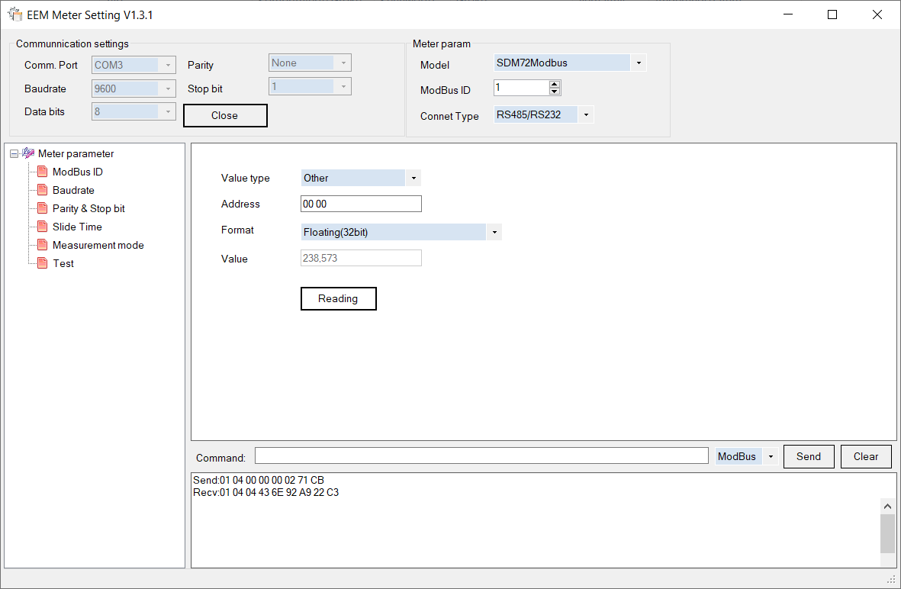

# SmartMeter query via ModBus
## Description
This project querys the input register from ModBus with a USB/RS485 Adapter.
I use this for a [Eastron SDM72DM-V2](https://stromzähler.eu/stromzaehler/drehstromzaehler/fuer-hutschiene-geeicht/246/sdm72dm-v2-mid-3-phasen-zweirichtungs-drehstromzaehler-mit-rs485-und-s0) MID3 - 3 Phase DIN Rail meter.

I tried various modbus packages from npm, but no ones workerd. To get what i want, i used the "EEM Meter" tool from the manufacturer and reverse enginiered the payload that is send over the USB/RS485 adapter.




## Example Output
```
Updated: 1644743149111
L1 Voltage: 236.73V
L2 Voltage: 236.74V
L3 Voltage: 234.95V
L1 Ampere: 0.09A
L2 Ampere: 2.79A
L3 Ampere: -2.89A
L1 Power: 13.32W
L2 Power: 621.36W
L3 Power: 15.75W
Sum of L1/L2/L3 currents: 2.96A
Total system power: -570.38W
Frequency: 49.91Hz
Total active Energy: 244.75kWh
```
This is currently just a output to the terminal/stdout.<br>
Later i want to send the values over a websocket connection to my [SmartHome solution](https://github.com/OpenHausIO)

> My Power/Energy is negative because i switched input/output from the mains (Hauptverteilung).
> Otherwise i had to mount the meter upside down, which is uggly.
> The meter can be used for import & export (Solar Panel) measurements.

## Installation
Just clone the repo, cd into the directory and do `npm install`.
After the successful installation of the npm packages, execute `node index.js` to read/write data.

## Configuration

| Environment variable | Default value  | Description                                                         |
| -------------------- | -------------- | ------------------------------------------------------------------- |
| NODE_ENV             | `production`   | Set to `development` to print debug messages                        |
| SERIAL_DEVICE        | `/dev/ttyUSB0` | USB/RS485 Serial Adapter                                            |
| SERIAL_BAUDRATE      | `9600`         | Baudrate for serial communication                                   |
| SERIAL_PARITY        | `none`         | Parity for serial communication                                     |
| SERIAL_STOPBITS      | `1`            | Stop bits for serial communication                                  |
| SERIAL_DATABITS      | `8`            | Data bits for serial communication                                  |
| QUERY_INTERVAL       | `5000`         | Time in ms how often the input registers should be quiered/refreshd |
| HTTP_ENABLED         | `true`         | Start a HTTP (WebSocket) Server if `true`                           |
| HTTP_ADDRESS         | `0.0.0.0`      | HTTP Server listening interface                                     |
| HTTP_PORT            | `8080`         | Websocket Server port                                               |
| PRINT_STDOUT         | `true`         | Print register values to stdout                                     |
| DEBUG                | `smart-meter`  | https://www.npmjs.com/package/debug                                 |
| SMART_METER_ID       | `1`            | ModBus slave ID                                                     |

## Miscellaneous
Is this a full modbus implemantion?
>This is not a full modbus implementation. I only managed to read the input registers, writing is currently not supported.

The input registers are not complete, in the [datasheet](./docs/SDM72DM-V2.pdf) are more listet than quired here.
> I dont need all registers, in the file `register.js` you can add or remove the one you need.